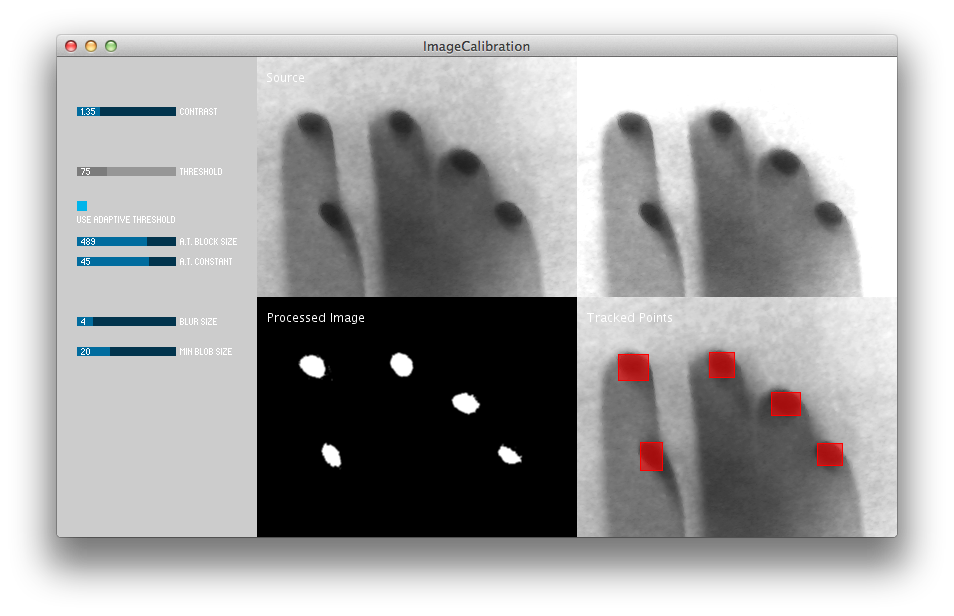
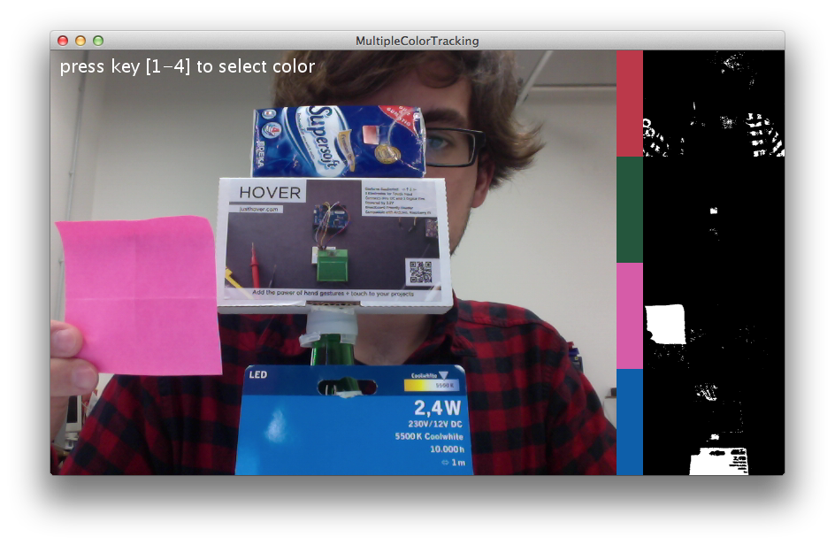

Image Filtering
=================

This repository contains a set of examples and tests for image filtering using [Processing](http://processing.org) and the [OpenCV library for Processing](https://github.com/atduskgreg/opencv-processing) by Greg Borenstein.

##Filtering the image for blob detection

The following sketch should help us to filter the source image for blob detection. It requires the [controlP5](http://www.sojamo.de/libraries/controlP5/) library.

Code: [ImageFiltering.pde](https://github.com/jorditost/ImageFiltering/blob/master/ImageFiltering/ImageFiltering.pde)

The sketch is doing the following:

- __Adjust contrast:__ highlight blobs
- __Thresholding:__ (Basic OR adaptive)
- __Noise reduction:__ (with dilation and erosion)
- __Blur filter:__ to remove remaining background noise
- __Set minimal blob size:__ to eliminate small blobs (spots, etc) that may be in the background.

#### Using basic thresholding

Thresholding is one of the most important filtering operations.

### Using adaptive thresholding
Adaptive thresholding is a more advanced option to filter your image. For environments with changing illumination or if you simply get a source image with shadows or irregular illumination, try better this. You can see an example in the next image, where the 

Just open the sketch and do some tests ;)

## Color Tracking

Simple color tracking based on the hue channel.

Code: [HSVColorTracking.pde](https://github.com/jorditost/ImageFiltering/tree/master/HSVColorTracking/HSVColorTracking.pde)

For color tracking with multiple colors, check this sketch:

Code: [MultipleColorTracking.pde](https://github.com/jorditost/ImageFiltering/tree/master/MultipleColorTracking/MultipleColorTracking.pde)

## Blob persistence (memory) over time

For some applications it may be important to "follow" a blob or an object over time (as markers or TUIO do).

> "One of the most common questions I get regarding blob tracking is “memory.” How do I know which blob is which over time? Computer vision libraries, for the most part, simply pass you a list of blobs (with x, y, width, and height properties) for any given moment in time. But the blobs themselves represent only a snapshot of that particular moment and contain no information related to whether the blobs existed before this very moment. This may seem absurd given that as human beings it’s so easy for us to watch a rectangle moving across a screen and understand conceptually that it is the same rectangle. But without additional information (such as color matching, an AR marker, etc.) there’s no way for an algorithm that analyzes one frame of video to know anything about a previous frame. And so we need to apply the same intuitions our brain uses (it was there a moment ago, it’s probably still there now) to our algorithms" (by [Daniel Shiffman](http://shiffman.net/2011/04/26/opencv-matching-faces-over-time/))

Inside the [BlobPersistence](https://github.com/jorditost/BlobPersistence/) repository, the sketch [WichFace](https://github.com/jorditost/BlobPersistence/tree/master/WhichFace) implements a persistence algorithm that follows faces over time. It is a modification of Daniel Shiffman's algorithm that works the OpenCV library for Processing by Greg.

The same algorithm is also implemented in the `ImageFilteringWithBlobPersistence` example in this repository to track blobs over time:

Code:
- [ImageFilteringWithBlobPersistence.pde](https://github.com/jorditost/ImageFiltering/tree/master/ImageFilteringWithBlobPersistenceImageFilteringWithBlobPersistence.pde): main sketch
- [Blob.pde](https://github.com/jorditost/ImageFiltering/tree/master/ImageFilteringWithBlobPersistence/Blob.pde): the Blob class

For detailed information about this algorithm visit Daniel Shiffman's blog:
http://shiffman.net/2011/04/26/opencv-matching-faces-over-time/

##Future Work
In the future this repository will contain more sketches for color tracking, camera calibration, etc.

##More
For more info about OpenCV and more examples, visit the library's github repository:
[https://github.com/atduskgreg/opencv-processing](https://github.com/atduskgreg/opencv-processing)
